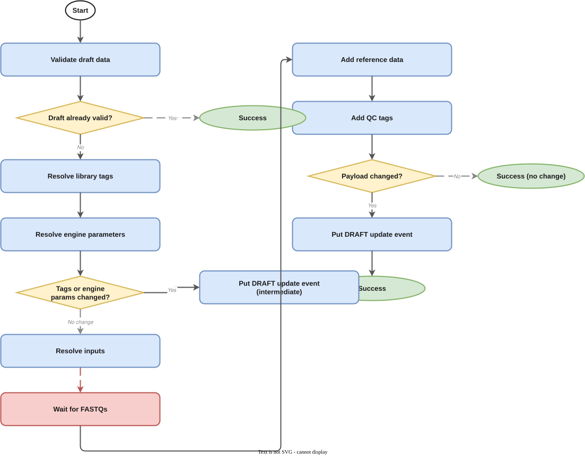
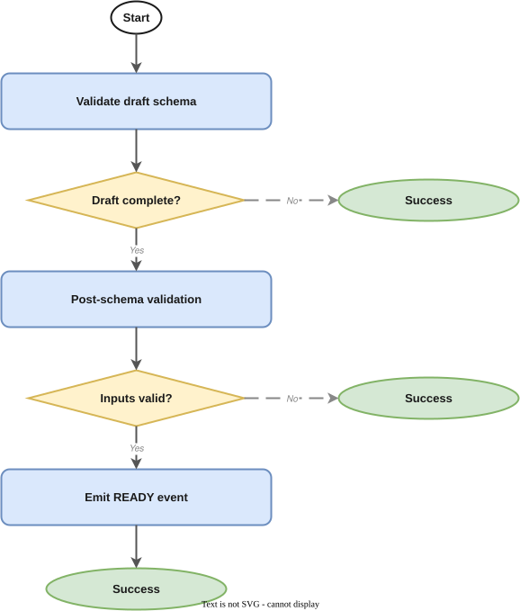
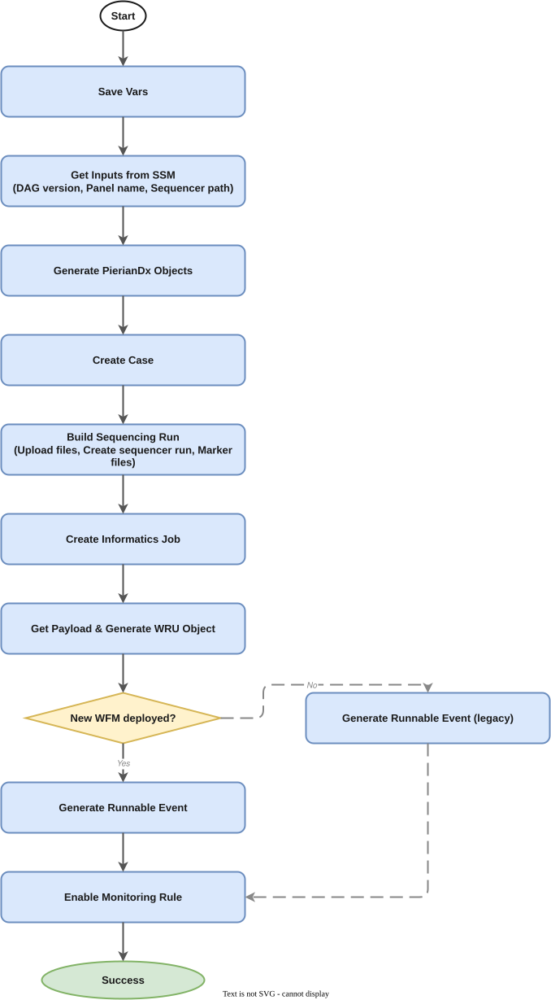
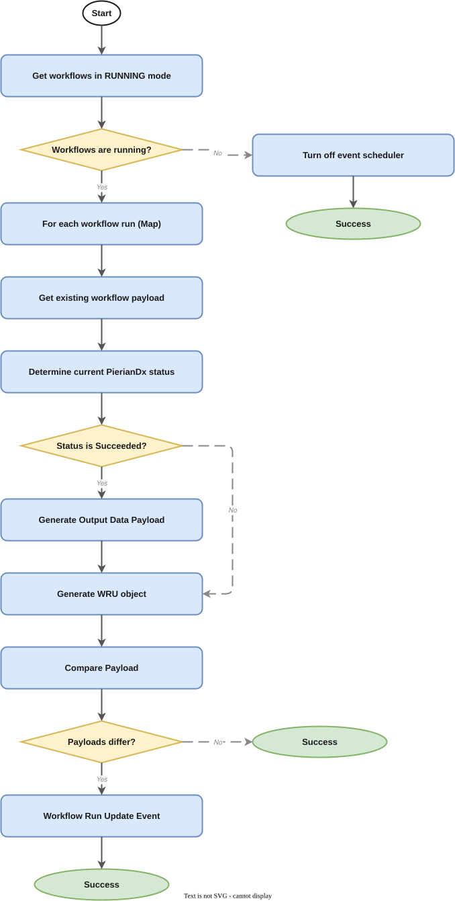
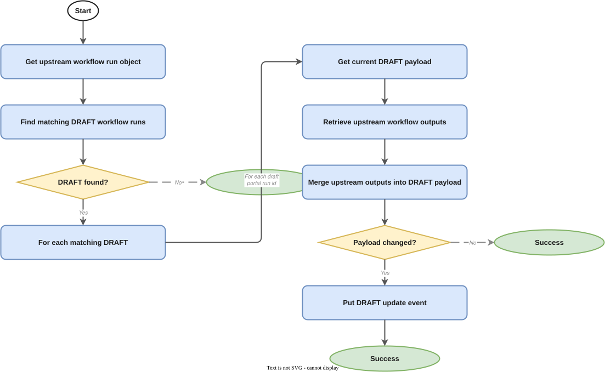

# PierianDx TSO500 ctDNA Pipeline Manager

- [Overview](#overview)
- [Pipeline State Flow](#pipeline-state-flow)
  - [1. DRAFT → populated DRAFT](#1-draft--populated-draft)
  - [2. Populated DRAFT → READY](#2-populated-draft--ready)
  - [3. READY → PierianDx case creation](#3-ready--pieriandx-case-creation)
  - [4. Monitor PierianDx runs](#4-monitor-pieriandx-runs)
  - [5. Upstream SUCCEEDED → DRAFT update (glue)](#5-upstream-succeeded--draft-update-glue)
- [Event Contract](#event-contract)
  - [Consumed Events](#consumed-events)
  - [Published Events](#published-events)
- [Draft Event Payload](#draft-event-payload)
  - [Minimal DRAFT event detail](#minimal-draft-event-detail)
  - [Auto-populated Fields](#auto-populated-fields)
  - [Schema Validation](#schema-validation)
- [Submitting a Draft Event](#submitting-a-draft-event)
- [Infrastructure](#infrastructure)
  - [Stateful Resources](#stateful-resources)
  - [Stateless Resources](#stateless-resources)
  - [Stacks](#stacks)
- [CI/CD and Release Management](#cicd-and-release-management)
- [Related Services](#related-services)
- [SOPs](#sops)
- [Glossary & References](#glossary--references)

---

## Overview

This service manages the lifecycle of the **PierianDx TSO500 ctDNA pipeline** — a clinical reporting pipeline that submits TSO500 ctDNA analysis results to Velsera's (formerly PierianDx) [Clinical Genomics Workspace (CGW)](https://app.pieriandx.com/cgw/) for variant interpretation and clinical report generation.

Unlike other OrcaBus pipeline managers that orchestrate CWL workflows on ICAv2, this service directly interacts with the PierianDx CGW API to create cases, upload sequencing data, launch informatics jobs, and monitor their completion. It follows the standard Pipeline Manager event model (DRAFT → READY → RUNNING → SUCCEEDED/FAILED) but uses the CGW API as its execution backend rather than ICAv2 WES.

**Upstream**: [Dragen TSO500 ctDNA](https://github.com/OrcaBus/service-dragen-tso500-ctdna-pipeline-manager)
**Downstream**: None (terminal pipeline — delivers clinical reports via PierianDx CGW)

---

## Pipeline State Flow

The service orchestrates five Step Functions state machines that together drive a workflow run from initial DRAFT submission through to PierianDx case creation, informatics job execution, and result reporting.

### 1. DRAFT → populated DRAFT

**State machine**: [`populate_draft_data_sfn_template`](app/step-functions-templates/populate_draft_data_sfn_template.asl.json)



When a `WorkflowRunStateChange` DRAFT event arrives, this state machine populates any missing payload fields by resolving defaults from SSM and querying upstream services:

1. **Resolve engine parameters** — project-specific settings for the PierianDx submission (DAG version, panel, disease)
2. **Resolve tags** — library metadata, case metadata from RedCap, SNOMED mappings
3. **Resolve inputs** — locate the upstream Dragen TSO500 ctDNA analysis outputs (VCF, metrics)
4. **Emit DRAFT update** if engine parameters or tags changed, then continue to input resolution

### 2. Populated DRAFT → READY

**State machine**: [`validate_draft_data_and_put_ready_event_sfn_template`](app/step-functions-templates/validate_draft_data_and_put_ready_event_sfn_template.asl.json)



Triggered when a DRAFT `WorkflowRunStateChange` event is received with a fully populated payload:

1. **Schema validation** — invokes `validate_draft_data_complete_schema` Lambda against the registered schema
2. **Post-schema validation** — business-rule checks beyond JSON Schema (RedCap metadata completeness, file existence)
3. **Push READY event** — emits a `WorkflowRunStateChange` READY event to the `OrcaBusMain` EventBridge bus

### 3. READY → PierianDx case creation

**State machine**: [`launch_pieriandx_from_ready_event_sfn_template`](app/step-functions-templates/launch_pieriandx_from_ready_event_sfn_template.asl.json)



Converts a READY event into a PierianDx CGW case and informatics job:

1. **Generate PierianDx objects** — create case metadata, sequencer run, and informatics job payloads
2. **Upload sample data** — transfer sequencing data files to PierianDx's S3 bucket
3. **Create case via CGW API** — submit the case, sequencer run, and launch the informatics job
4. **Emit RUNNING event** — emits a WorkflowRunUpdate with RUNNING status

### 4. Monitor PierianDx runs

**State machine**: [`monitor_pdx_runs_sfn_template`](app/step-functions-templates/monitor_pdx_runs_sfn_template.asl.json)



Runs on a schedule to poll active PierianDx informatics jobs:

1. **List active runs** — queries the Workflow Manager for runs in RUNNING state
2. **Check job status** — polls the CGW API for each active job's status
3. **Route by status**:
   - **Completed** — collects output data (report links, VCF URIs), emits SUCCEEDED event
   - **Failed** — writes failure comment, emits FAILED event
   - **Still running** — no action (will be checked again on next schedule)

### 5. Upstream SUCCEEDED → DRAFT update (glue)

**State machine**: [`glue_succeeded_events_to_draft_update_sfn_template`](app/step-functions-templates/glue_succeeded_events_to_draft_update_sfn_template.asl.json)



Reacts to upstream Dragen TSO500 ctDNA SUCCEEDED events:

1. **Find matching DRAFT runs** — queries Workflow Manager for existing DRAFT runs with matching libraries
2. **Merge upstream outputs** — incorporates the upstream analysis outputs into the DRAFT payload
3. **Emit DRAFT update** — emits a WorkflowRunUpdate DRAFT event if the payload changed

---

## Event Contract

### Consumed Events

| DetailType | Source | Schema | Description |
|---|---|---|---|
| `WorkflowRunStateChange` | `orcabus.workflowmanager` | [WorkflowRunStateChange](https://github.com/OrcaBus/wiki/tree/main/orcabus-platform#workflowrunstatechange) | Carries DRAFT (and later READY) workflow run records |

### Published Events

| DetailType | Source | Schema | Description |
|---|---|---|---|
| `WorkflowRunUpdate` | `orcabus.pieriandxtso500ctdna` | [WorkflowRunUpdate](https://github.com/OrcaBus/wiki/blob/main/orcabus/platform/events.md#workflowrunupdate) | Pipeline state updates (READY, RUNNING, SUCCEEDED, FAILED) |

---

## Draft Event Payload

A DRAFT event can be submitted with a minimal `data` payload — the populate state machine resolves all defaults. The `data` object may be omitted entirely. The final validated payload must satisfy the [complete-data draft schema](app/event-schemas/complete-data-draft-schema.json).

### Minimal DRAFT event detail

```json
{
  "status": "DRAFT",
  "workflowName": "pieriandx-tso500-ctdna",
  "workflowVersion": "2.8",
  "workflowRunName": "umccr--automated--pieriandx-tso500-ctdna--2-8--<portalRunId>",
  "portalRunId": "<portalRunId>",
  "linkedLibraries": [
    { "libraryId": "L2400001", "orcabusId": "lib.01..." }
  ]
}
```

The `payload.data` object may be included to override any auto-populated fields. An empty or absent `payload.data` is valid.

### Auto-populated Fields

All of the following are resolved by the populate state machine if not explicitly provided:

| Field | Resolved from |
|---|---|
| `engineParameters.dagVersion` | SSM: default DAG version |
| `engineParameters.panel` | SSM: panel map for the library's assay |
| `engineParameters.disease` | RedCap: specimen disease/indication |
| `tags.libraryId` | From `linkedLibraries` |
| `tags.subjectId` / `individualId` | Metadata service |
| `tags.sampleType` | RedCap metadata |
| `tags.externalSubjectId` | RedCap metadata |
| `inputs.tso500OutputDataUri` | Upstream Dragen TSO500 ctDNA outputs |

### Schema Validation

The complete-data schema is registered in the AWS Schemas registry and used for validation. You can interactively validate a payload at:

- [JSON Schema Validator — Complete DRAFT data](https://www.jsonschemavalidator.net/s/4mjkB0UT)

---

## Submitting a Draft Event

To manually submit a PierianDx TSO500 ctDNA DRAFT event (e.g. to trigger a reanalysis), follow:

- [PM.PTC.1 — Manual Pipeline Execution](docs/operation/SOP/PM.PTC.1/PM.PTC.1-ManualPipelineExecution.md)

See the [full SOPs index](docs/operation/SOP/README.md) for all operational procedures including deployment, parameter updates, and troubleshooting.

---

## Infrastructure

The service is deployed via AWS CDK. Resources are split into two stacks: stateful (data/config) and stateless (compute/events).

All SSM parameters live under `/orcabus/workflows/pieriandx-tso500-ctdna/`.
Event bus: `OrcaBusMain`
Event source: `orcabus.pieriandxtso500ctdna`

### Stateful Resources

**AWS Schemas registry**
- `orca-pdx--completeDataDraft` — used to validate DRAFT payloads before promotion to READY

**SSM Parameters**

| Parameter | Description |
|---|---|
| `workflowName` | `pieriandx-tso500-ctdna` |
| `workflowVersion` | Current default version |
| `payloadVersion` | Payload schema version |
| `dagVersion` | Default PierianDx DAG version |
| `panelMap` | Panel configuration per assay |
| `projectInfoMap` | Project/specimen type mappings |

**S3 Buckets**
- SNOMED lookup bucket — stores SNOMED code-to-disease mappings for CGW submissions

**Secrets Manager**
- PierianDx S3 credentials — cross-account transfer bucket access
- PierianDx auth tokens — CGW API authentication

### Stateless Resources

- **Lambda functions** (Python 3.14, ARM64) — one per task in the state machines; see [`app/lambdas/`](app/lambdas/)
- **Lambda layers** — `pieriandx_tools_layer` for shared CGW API client utilities
- **Step Functions state machines** — five ASL templates in [`app/step-functions-templates/`](app/step-functions-templates/)
- **EventBridge rules** — route incoming `WorkflowRunStateChange` (DRAFT, READY) and upstream SUCCEEDED events

### Stacks

The CDK project deploys a CodePipeline in the toolchain account that promotes changes to `beta`, `gamma`, and `prod`.

```sh
# List stateful stacks
pnpm cdk-stateful ls

# List stateless stacks
pnpm cdk-stateless ls
```

---

## CI/CD and Release Management

All changes merged to `main` are automatically built and deployed to `beta` and `gamma`. Promotion to `prod` requires manually enabling the CodePipeline transition in the AWS console.

Beta/Gamma environments use the PierianDx UAT endpoint; Prod uses the production CGW endpoint.

---

## Related Services

| Role | Service |
|---|---|
| Upstream | [Dragen TSO500 ctDNA](https://github.com/OrcaBus/service-dragen-tso500-ctdna-pipeline-manager) |
| Workflow state | [Workflow Manager](https://github.com/OrcaBus/service-workflow-manager) |
| Metadata | [RedCap APIs](https://github.com/umccr/redcap-apis) |
| File tracking | [File Manager](https://github.com/OrcaBus/orcabus/tree/main/lib/workload/stateless/stacks/filemanager) |

---

## SOPs

| SOP | Description |
|---|---|
| [PM.PTC.1](docs/operation/SOP/PM.PTC.1/PM.PTC.1-ManualPipelineExecution.md) | Manually kick off a reanalysis |
| [PM.PTC.2](docs/operation/SOP/PM.PTC.2/PM.PTC.2-DeployingNewPipelineVersion.md) | Deploy a new pipeline version |
| [PM.PTC.3](docs/operation/SOP/PM.PTC.3/PM.PTC.3-UpdatingSsmParameters.md) | Update SSM parameters |
| [PM.PTC.4](docs/operation/SOP/PM.PTC.4/PM.PTC.4-RunningWorkflowValidations.md) | Run workflow validations |
| [PM.PTC.5](docs/operation/SOP/PM.PTC.5/PM.PTC.5-Troubleshooting.md) | Troubleshoot common issues |

---

## Glossary & References

- Platform glossary: [OrcaBus wiki](https://github.com/OrcaBus/wiki/blob/main/orcabus-platform/README.md#glossary--references)
- For development setup, build commands, project structure, and conventions see the [steering docs](.kiro/steering/).
